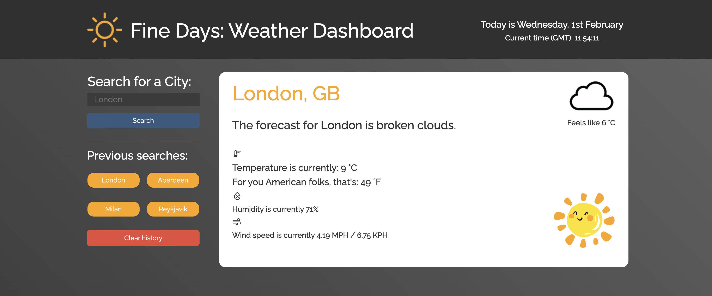

<!-- Readme top-->

<!-- Project shields -->

<!-- centered shields -->

  [![Stargazers][stars-shield]][stars-url]
  [![Issues][issues-shield]][issues-url]
  [![MIT License][license-shield]][license-url]
  [![LinkedIn][linkedin-shield]][linkedin-url]

<!-- Readme Header -->

  

<!-- PROJECT LOGO -->
 

  <a href="https://github.com/Matt-Jones-Developer/fine_days_weather_dashboard">
    <!--  -->
  </a>

#
<h2 align="center">"Fine Days": The Weather Dashboard App</h2>

  

    A more complex weather app, that ultilises the openweathermap API.
    Coded in vanilla JavaScript with dynamically rendered HTML, and an HTML and CSS interactive GUI.
     
    <a href="https://github.com/Matt-Jones-Developer/fine_days_weather_dashboard/"><strong>Explore the docs »</strong></a>
     
     
    <a href="https://github.com/Matt-Jones-Developer/fine_days_weather_dashboard">View Project</a>
    ·
    <a href="https://github.com/Matt-Jones-Developer/fine_days_weather_dashboard/issues">Report Bug</a>
    ·
    <a href="https://github.com/Matt-Jones-Developer/fine_days_weather_dashboard/issues">Request Feature</a>
    ·
    <a href="https://github.com/Matt-Jones-Developer?tab=repositories">Check out my work</a>
    ·
  

#

<!-- TABLE OF CONTENTS -->

  
Table of Contents

  <ol>
    <li>
      <a href="#about-the-project">About The Project</a>
      <ul>
        <li><a href="#built-with">Built With</a></li>
      </ul>
    </li>
    <li>
      <a href="#getting-started">Getting Started</a>
      <ul>
        <li><a href="#prerequisites">Prerequisites</a></li>
        <li><a href="#installation">Installation</a></li>
      </ul>
    </li>
    <li><a href="#usage">Usage</a></li>
    <li><a href="#roadmap">Roadmap</a></li>
    <li><a href="#contributing">Contributing</a></li>
    <li><a href="#license">License</a></li>
    <li><a href="#contact">Contact</a></li>
    <li><a href="#acknowledgments">Acknowledgments</a></li>
  </ol>

<!-- ABOUT THE PROJECT -->
## About The Project

TODO:

## Overview
 
[TODO]

#

<!-- the product -->

## The Product

Product screenshot:

[![Product Name Screen Shot][product-screenshot]](https://github.com/Matt-Jones-Developer/fine_days_weather_dashboard)

[![Product Name Screen Shot][product-screenshot-2]](https://github.com/Matt-Jones-Developer/fine_days_weather_dashboard)

## Criteria

[TODO]
      

#

(<a href="#readme-top">back to top</a>)

### Built With:

<!-- languages logos -->

![js-logo]::: [![JavaScript]][javascript-url] ![html5-logo]::: [![HTML5]][html5-url] ![css-logo]::: [![CSS]][css-url]

(<a href="#readme-top">back to top</a>)

#

<!-- GETTING STARTED -->

## Getting Started

This very easy to use GUI application that can be accessed through your web browser, you can also see the JS working under the hood by entering the console.

When you first load the page, the current weather panel is blended into the main body.  When you select a city (I check for blank or incorrect entries too), the 'viewer' section will turn white and render all the current weather data onto the page, dynamically.
Once you have noticed the pulse animated icons, you can scroll down to view a five day forecast, with more colour changing, pulse animinated temperatures (Chrome only).  

To get started, search for a city (you can also search for certain countries too, (but check the country code, it may be in the U.S).

Once complete, you hit the search button or press 'enter' - the weather update will be printed to the viewer, ready for you to peruse!
API calls in city, country, temperature, humidity and wind speed.  These are handled by conversion functions that output in Celsius, Fahrenheit and MPH/KPH. 

Every city is saved to it's own button, which can be re-called just by clicking them. These cities will be saved in local storage until you remove them.  If you hit the remove history button - they will clear.

Please open main.js within the scripts folder to view my JS code. I split the code into data and generated scripts as I felt it was much cleaner and better for future updating and maintenance. 

You can also see my tests folder for all the testing, tinkering and coding revisions I made to reach my solutions.  The pseudo was  a lot more focussed this time, breaking down each problem and trying to work out the data side of things first, before tinkering with the GUI styling too much.  But, I can't resist CSS styling most days, so I always start to improve the look and feel of the app from day 1 to take a break from the coding solutions!

I am particularly proud of this clean, professional code, the overall look and feel and that (a few small bugs aside) it meets all the criteria.

Enjoy.

#
### Prerequisites

N/A

#

### Installation

No installation required.  Just load your browser. 

You can clear your caches local storage (buttons and cities visited) by hitting the remove button.

----------------------------------

<!-- USAGE EXAMPLES -->
## Usage and Screenshots

Screenshot of the programs output with
fully responsive design:

![tablet-screenshot1]

<!-- centered images -->

<!-- ![mobile-screenshot1] ![mobile-screenshot2] -->
  
  

Console log:

![console-output-screenshot]

(<a href="#readme-top">back to top</a>)

----------------------------------

<!-- ROADMAP -->
## Roadmap

1. build up with a MAP API, some trending tourist sites and local restaurants etc
2. improve on the existing features and re-design the GUI so there's no blank space 
3. improve the UI further, add new features and add my UX design principles 
4. build an advanced user log-in backend database that stores all the user data 

(<a href="#readme-top">back to top</a>)

#

<!-- UX/UI DESIGN -->
## UX/UI Design

Screenshot of the web apps UI design stage:

[![Design Screen Shot][wireframe-screenshot]](https://github.com/Matt-Jones-Developer/fine_days_weather_dashboard)

(<a href="#readme-top">back to top</a>)

#

<!-- CONTRIBUTING -->
## Contributing

N/A

#

<!-- LICENSE -->
## License

Distributed under the MIT License. See `LICENSE.txt` for more information.

(<a href="#readme-top">back to top</a>)

#

<!-- CONTACT -->
## Contact

Matt Jones - [@glitchy81_dev](https://twitter.com/glitchy81_dev)

#

## Project links

Project Repo Link: [https://github.com/Matt-Jones-Developer/password_generator](https://github.com/Matt-Jones-Developer/fine_days_weather_dashboard)

Deployed Project Link: [https://matt-jones-developer.github.io/password_generator](https://matt-jones-developer.github.io/fine_days_weather_dashboard)

(<a href="#readme-top">back to top</a>)

<!-- ACKNOWLEDGMENTS -->
## Acknowledgments

* [Developed from this original README Template](https://github.com/othneildrew/Best-README-Template)

(<a href="#readme-top">back to top</a>)

<!-- MARKDOWN LINKS & IMAGES -->
<!-- https://www.markdownguide.org/basic-syntax/#reference-style-links -->
[contributors-shield]: https://img.shields.io/github/contributors/matt-jones-developer/fine_days_weather_dashboard.svg?style=for-the-badge
[contributors-url]: https://github.com/matt-jones-developer/password_generator/graphs/contributors
[forks-shield]: https://img.shields.io/github/forks/matt-jones-developer/fine_days_weather_dashboard.svg?style=for-the-badge
[forks-url]: https://github.com/Matt-Jones-Developer/password_generator/network/members
[stars-shield]: https://img.shields.io/github/stars/matt-jones-developer/fine_days_weather_dashboard.svg?style=for-the-badge
[stars-url]: https://matt-jones-developer.github.io/fine_days_weather_dashboard/stargazer
[issues-shield]: https://img.shields.io/github/issues/matt-jones-developer/fine_days_weather_dashboard.svg?style=for-the-badge
[issues-url]: https://github.com/Matt-Jones-Developer/fine_days_weather_dashboard/issues
[license-shield]: https://img.shields.io/github/license/matt-jones-developer/fine_days_weather_dashboard.svg?style=for-the-badge
[license-url]: https://github.com/Matt-Jones-Developer/fine_days_weather_dashboard/blob/main/LICENSE.txt
[linkedin-shield]: https://img.shields.io/badge/-LinkedIn-black.svg?style=for-the-badge&logo=linkedin&colorB=555
[linkedin-url]: www.linkedin.com/in/matt-jones-zx81
[product-screenshot]: assets/images/screenshots/app_screenshot.png
[product-screenshot-2]: assets/images/screenshots/app_screenshot_2.png
[product-screenshot-3]: assets/images/screenshots/app_screenshot_3.png
[product-screenshot-4]: assets/images/screenshots/app_screenshot_4.png
[console-output-screenshot]: assets/images/screenshots/console_output.png
[wireframe-screenshot]: ./assets/images/screenshots/wireframing.png
[tablet-screenshot1]: ./assets/images/screenshots/ipad-screenshot.png
[mobile-screenshot1]: ./assets/images/screenshots/mobile-screenshot1.png
[mobile-screenshot2]: ./assets/images/screenshots/mobile-screenshot2.png
[javascript-url]: https://www.javascript.com
[html5-url]: https://html5.org/
[css-url]: https://www.w3.org/Style/CSS/Overview.en.html
[js-logo]: assets/images/logos/js.svg
[html5-logo]: assets/images/logos/html5.svg
[css-logo]: assets/images/logos/css3.svg

